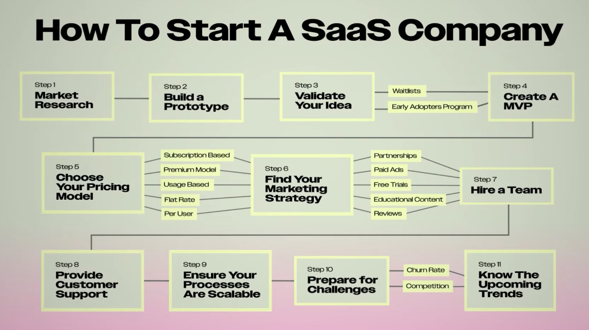

How To Start a SaaS Company in 2025 
#######################################

| Date: 01/16/2016
| Last Updated: 01/16/2016

Context 
**********

This is very informative video I came across and I wanted to transcribe and 
note relevant sections of that video.

Materials
************

* Video link: `How To Start a SaaS Company in 2025 | YouTube`_ 
* Publish by: ``Learn With Shopify``
* Premiered Date: ``Jan 6, 2025``
* Host: Karisma Collins, content creator & Host.

.. raw:: html

    <iframe width="560" height="315" 
    src="https://www.youtube.com/embed/SddMq2nKsUA?si=v-Mks5rmNnU3_59G" 
    title="YouTube video player" frameborder="0" 
    allow="accelerometer; autoplay; clipboard-write; encrypted-media; gyroscope; picture-in-picture; web-share" 
    referrerpolicy="strict-origin-when-cross-origin" 
    allowfullscreen></iframe>

Note/Transcription
********************

SaaS (Software as a Service ) 

* is booming

    * expected to grow over $200 billion in Revenue by 2025 with businesses with 
      reoccurring revenue and scalable potential.

*  is a cloud-based model  where users access software over the internet without 
   needing to download it. 

The best part of running a SaaS company 

* is that you can build the product once and you can sell it forever.
* you can run it remotely.

**Goals and Objectives**

1. Steps to take to create your own SaaS company and create a reoccurring and 
   consistent income.

This will show you 

* How to build the business 
* validate a Business
* Market it
* Scale. 

**How to Build**

SaaS companies have a unique advantage in the marketplace with reoccurring
Revenue scalability Global reach. So how do you make sure that there are people
out there willing to spend money on your product first you need to do market?

1. **Step 1: Market Research**

    .. image:: ./_images/JNL-001_SaaS_1.0_Step1MarketResearch.png
        :width: 650px 

    * the most important part of any business is making sure that there is a market 
      for it which means that people are already spending their money on this.

      The first two questions you must answer before any other question

        1. What problem is your SAS product solving for people? 
        2. and who are you solving it for?
      
    * Google and start researching 
        
        A. your competition the market size  
        B. and gather all the data that you can about your industry such as 

            .. image:: ./_images/JNL-001_SaaS_1.1_Step1MarketResearch_MarketGrowthEtc.png
                :width: 400px 

            * market growth 
            * who spends the most money on your kind of SAS software 
            * and what are the emerging Trends in the industry you can also use.
        
        .. note:: You can use a software called ``Frederic AI`` for this.
            
            .. image:: ./_images/JNL-001_SaaS_1.2_Step1MarketResearch_FrederricAI.png
                :width: 450px
    
2. **Build A prototype first** rather than wasting thousands of dollars building out a
   product before you even have a customer.
    
    .. image:: ./_images/JNL-001_SaaS_2.0_Step2BuildAPrototype.png
        :width: 650px 

    * Do this by building a wireframe.

        * you can draw one with pen and pencil

            .. image:: ./_images/JNL-001_SaaS_2.1.0_Step2BuildAPrototype_Wireframe_Pencil.png
                :width: 400px 

        * or you can use programs like *balsamic* or *figma* to make one.

            .. image:: ./_images/JNL-001_SaaS_2.1.1_Step2BuildAPrototype_Wireframe_Figma.png
                :width: 400px
        
        .. important:: it is really important to  know what kind of interface 
            design you want when you start working with developers so a 
            wireframe is essential.
    
    The next tip is going to save you from pouring money down the drain. It is 
    the number one thing that most business get wrong.

#. **Validate your Idea**

    .. image:: ./_images/JNL-001_SaaS_3.0_Step3ValidateYourIdea.png
        :width: 650px
    
    .. note:: the moment someone pays you is the moment you officially have a 
        business method.
    
    .. card:: method 1:

        * you can start a wait list to get users to sign up before you build the app 

            * you can create a weight list with apps like 

                * ``wait.li``
                * ``viral loops``
                * ``shopify forms``
                * ``google forms``

        * you can incentivize people to share the wait list by giving them points 
          or discounts to your software 

    .. card:: Method 2:

        The best way to to validate your idea create an *early adopter program*
        
        .. image:: ./_images/JNL-001_SaaS_3.2_Step3ValidateYourIdea_EarlyAdopterPrograms.png
            :width: 400px 

        * It offers participants a chance to invest in your software by purchasing 
          a discount for the first year.

            .. image:: ./_images/JNL-001_SaaS_3.2.1_Step3ValidateYourIdea_EarlyAdopterPrograms_Example.png
                :width: 400px 
                
            .. note:: if done successfully this prove that people don't just like your 
                products, they are willing to pay for it.
        
            * Name the program and provide exclusive benefits such as verified status
              and involvement in feature creation.
                           
                Example: AgentForce

                .. image:: ./_images/JNL-001_SaaS_3.2.2_Step3ValidateYourIdea_EarlyAdopterPrograms_ExampleAgentForce.png
                    :width: 400px 
            
            .. important:: Remember, even if people say they like the idea if 
                people don't pay they're unlikely to spend their money when it's launched.

#. **Create an MVP**

    .. image:: ./_images/JNL-001_SaaS_4.0_Step4CreateMVP.png
        :width: 500px
    
    * With A *Minimum Viable Product* (MVP), you can create minimal features to 
      show what your app or software will be like. 
    
        * You can use programs like *figma*, *bubble*, *shopify*, or *glide*
    
    Here are a few example big firms start with:

    * *Buffer* - a social media toolkit for small business.

        * first launched with a simple landing page just explaining the concept 
          of scheduling social media posts.
    
    * *Zappier* - the tool that integrates all your web apps.

        .. image:: ./_images/JNL-001_SaaS_4.1.0_Step4CreateMVP_startSmall_ExampleZappier.png
            :width: 400px 

        * first it began as a manual process where the founder literally manually 
          connected apps behind the scenes.
    
    * *AirBnB*

        * The founders of Airbnb listed their own apartment on a simple website 
          to test if someone would be willing to pay to stay in someone's home.

#. **Choose Your Pricing Model**

    .. card:: How should you price your product?
        
        .. note:: Before you think of your model you should research what other SAS products 
            in your space are charging.   This way you can

            * get an idea of the market value
            
            You also want to consider if you have any monthly cost to run your business 
                
            * make sure your price reflects what you would need in order to 
              pay off your initial investment within the next few years or 
              months and  to cover your monthly costs

        Here are some potential pricing model to consider for your SaaS product.

        1. **Subscription based pricing**

            - this is where customers pay a reoccurring monthly or annual fee to 
              get access to the product.

                - ex: companies like Netflix, Shopify, and Spotify.
        
        2. The **premium model**

            - offers a basic version of the product for free and then charge for 
              premium features

                - Ex: CapCut, Dropbox
        
        #. **Usage based pricing**

            - customers pay based on how much they actually use the product.
                
                - ex: *stripe*

        #. **Flat rate pricing**

            - The company will use flat rate pricing. Customer will pay that get 
              access to all the features.

                - ex: *Notion*, *Adobe Express*
        
        #. **Per User Pricing**

            - You can charge customers based on how many users there are in their 
              account.

                - ex: *Slack*, *Zoom*
        
        There are more options but these are great strategies.

        .. compound:: Patrick Campbell
            :class: light-gray-bg 

            "A great pricing strategy doesn't just maximize revenue, **it maximizes 
            your customers' success**"

#. **Marketing**

    .. note:: The nicest thing about SAS products is that there is no shipping involved so 
        anybody in the world can access your products immediately at any time. 

    I. First, **partner with any key people of influence in your field**.
        
       influencers, thought leaders,  businesses,  and groups 
        
        A. give them free access to your platform in exchange for them to 
           share it if they like it. 
        B. you can also use affiliate marketing and give influencers a percent 
           of each referral that signs up. 

            .. note:: You want to associate your brand with people they trust and 
                respect. Plus you're going to reach a whole new audience this 
                way.
        
        .. card:: How to find these people?

            1. Use ChatGPT or google Gemini

                .. image:: ./_images/JNL-001_SaaS_6.1_Step6Marketing_FindInfuentialPeeps.png
                    :width: 400px
                
            #. Use software like *Linkedin Sales Navigator* or other emails finder 
               tools like *Apollo.io* to get the contact of the exact people you 
               want.

                .. image:: ./_images/JNL-001_SaaS_6.2_Step6Marketing_LinkedInSalesNavigator.png
                    :width: 500px 
            
            #. *Shopify Collabs* is also a great place to find Affiliates
    
    #. **Run paid ads**.

        * Chances are a lot of people who need your product are hanging out on 
          social media and you could Target them to sell your product through 
          *consumer generated content (CGC)* or through user-generated content (UGC)
          or just ad creatives in general.
    
    #. **Offer a free trials for new users.** so they can test out your app and 
       once they love it give you their money.
    
    #. **Create educational content**

        - Focus on your product,
        - build a community.

        .. important:: Make sure to give as much values as you can. 
    
    #. **Utilize Positive Reviews**

        .. image:: ./_images/JNL-001_SaaS_6.5_Step6Marketing_PositiveReviews.png
            :width: 400px

        - put good reviews and customer success stories all over your front page.
            
            * People trust reviews
        
        - you can also add your app or software to the  Shopify app store if 
          your SaaS software serves businesses.
    
#. **Hire a Team**

    .. image:: ./_images/JNL-001_SaaS_7.0_Step7HireATeam.png
        :width: 650px 

    - A team of developer to build out the software.
    - UI or UX designers for your interface. 
    - You may also need a devops engineer 
    - product managers 
    - and customer services representatives.
    - you can hire a sales team on a percentage basis or you just do sales on your 
      own.
    

    .. note:: YOu can find people in platform like 

        * ``Toptal`` - Hire the top 3% of Freelance Talent.
        * ``Wellfound`` - made for startup 
        * ``Gun.io`` - to find software teams.
    
    .. note:: You don't need a big team to start, 
        
        * you may need to do everything on your own in the beginning. 
            
            * The biggest thing you need is to outsource product development 
              to get up and running. 
                
                * But be careful who you give your equity to.

        * You can also build SaaS software with no-code apps such as 
          *.bubble*, *Glide*, or *Adalo*.

            * The downside is that you don't fully own the software because it 
              is run on their platform.

                * if something happens to them, you may not have a software anymore.
            
        * You can build an app on *Firebase*  
        * You could use *MAXIO* for billing.
        * You can use *Fullstory* for behavioral data.  
            

#. Customer Support

    .. image:: ./_images/JNL-001_SaaS_8.0_Step8CustomerSupportAndEngagement.png
        :width: 450px 

    * always always keep your software up to date and iron out any bugs in the system 
        
        * you want to make sure your product is actually solving your customer's 
          problem.

    * you will also want to Monitor and respond to customer feedback.

        * the goal is to keep people on the platform for as long as you can.
     
#. **Ensure your processes are scalable**

    .. image:: ./_images/JNL-001_SaaS_9.0_Scale.png
        :width: 650px 

    * we always want to be thinking about the future of our business.   
      you want to make sure that your processes are scalable.
    
    Here are some ways you can scale: 
    
    * the whole point of scaling is doing more of what is working so use 
      something called the **80/20** rule
        
        .. image:: ./_images/JNL-001_SaaS_9.1_Scale_8020Rule.png
            :width: 400px

        * the 80/20 rule states that 80% of your results come from 20% of 
          what you do and 20% of your results come from 80% of what you do.

            
        * so narrow down what's actually working for you and do more of it.
            
            * for example if you're getting most of your customers from ads,
              put more money into pushing ads 
            
            * if most of your revenue is coming from Paid features upgrades, build 
              more of those for customers to buy.
    
    * Once you have customer data, refine your target customer and re-target them 
      with ads.

        .. image:: ./_images/JNL-001_SaaS_9.2_Scale_RefineTargets.png
            :width: 400px 
    
    *  you can also upsell your customers.
        
        * solve the problems they face before during and after using your products 
          and then charge them for it.
    
    * You want to expand your market and start selling to new locations or even 
      adapt your product to meet the needs of adjacent Industries.
    
    * you can also build a sales team around your product or even automate your 
      current processes.
    
    * you can also raise additional funding to pour into your business.
    * Most importantly, pour your money into places where money is already 
      **pouring out for you**

        .. image:: ./_images/JNL-001_SaaS_9.3_Scale_PourMoney.png
            :width: 400px 
    

#. **Prepare for some challenges**

    .. image:: ./_images/JNL-001_SaaS_10.0_PrepForChallenges.png
        :width: 650px 
    
    **ROME WAS NOT BUILT IN A DAY**

    Here are some challenges you may face:

    I. Churn rates 

        .. image:: ./_images/JNL-001_SaaS_10.1_PrepForChallenges_ChurnRate.png
            :width: 400px

        * Churn rate is the the percentage of customers that stop using your 
          services within a given time frame.
        
        * :math:`churn \ rate\ \% = (\frac{Total\ No\ of\ Customer\ Lost}{Total\ No\ of\ customers\ at\ the\ start\ of\ the\ period}) * 100`

        .. important:: The typical SaaS Churn rate is 5%. so if customers are 
            running away a little too fast and you have a higher turn rate 
            
            * make sure to check in on what might be causing it and improve those areas 
                
                * you can also run a survey to ask people why they left competition 
    
    #. Competitions

        * there will always be competitors in the ring but that's kind of 
          what makes life fun it's a challenge.
        
        * other competitors may lower their prices, steal your features 
          and improve on them or even steal your customers 
            
            * so pay attention to what your customers are asking for 
            * and always keep your features up to date this way you can 
              stand out in a saturated Market. 

#. **Know the upcoming Trends**

    .. image:: ./_images/JNL-001_SaaS_11.0_Trends.png
        :width: 650px
    
    There are a lot of new trends in the SaaS space, 
    
    I. AI - the biggest one
    #. Data as a service.

        ex: SnowFlake

        .. image:: ./_images/JNL-001_SaaS_11.1_Trends_DataAsAService.png
            :width: 400px 
    
    #. Platform as a service

        ex: HeroKu

        .. image:: ./_images/JNL-001_SaaS_11.2_Trends_PlatformAsAService.png
            :width: 400px 
    
    #. Market consolidation 
        
        * big companies are actually acquiring smaller companies in their space 
          so it could be a good strategy to build a SAS company and then sell it 
          to a bigger player.

    #. Micro SaaS 

        .. image:: ./_images/JNL-001_SaaS_11.3_Trends_MicroSaaS.png
            :width: 400px 
        
        * these are operating on a much smaller
    
    #. White Label SaaS

        - is where you can purchase unbranded SAS software and just put your 
          brand on it
        
        .. image:: ./_images/JNL-001_SaaS_11.4_Trends_WhiteLabelSaaS.png
            :width: 400px 
        

Summary 
=========

Advices
=========

1. The biggest thing you can work on as an entrepreneur is your mindset 
    
    * everything you do stems from your belief system.
    * so make sure you're feeding your brain with thought food that fuels your 
      entrepreneurial Journey 

2. It will not be easy you're probably going to be challenged more than you ever 
   have been but there's a quote that I really resonate with: 
   
    .. compound:: 
        :class: light-gray-bg
        
        Being an entrepreneur means doing the **known work** for the 
        **unknown outcome**
    
    * you don't know what your results will be until you try but the best thing 
      you can do is take action and do the work you know what you need to do.

3. the other most important thing is speed 
    
    * make sure you're taking action quickly ideas can ruminate in our heads 
      for years and never make it out of our minds so go get out there and build 
      a killer sass product

.. include:: ../relevant_urls.rst